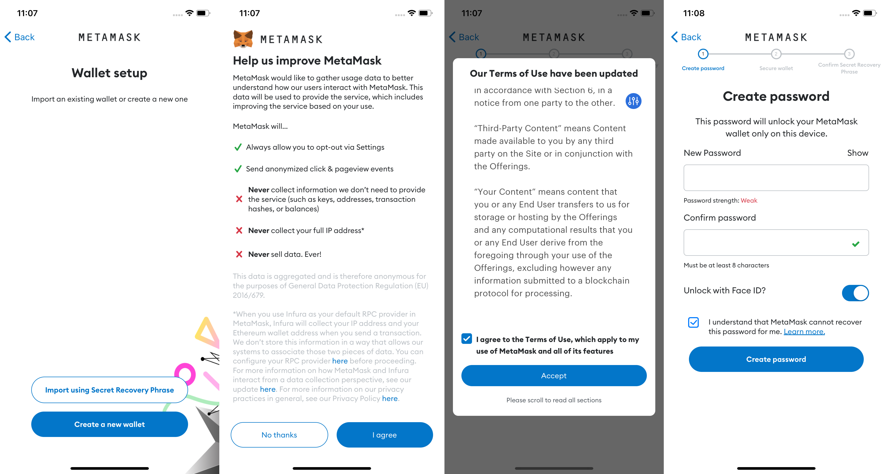
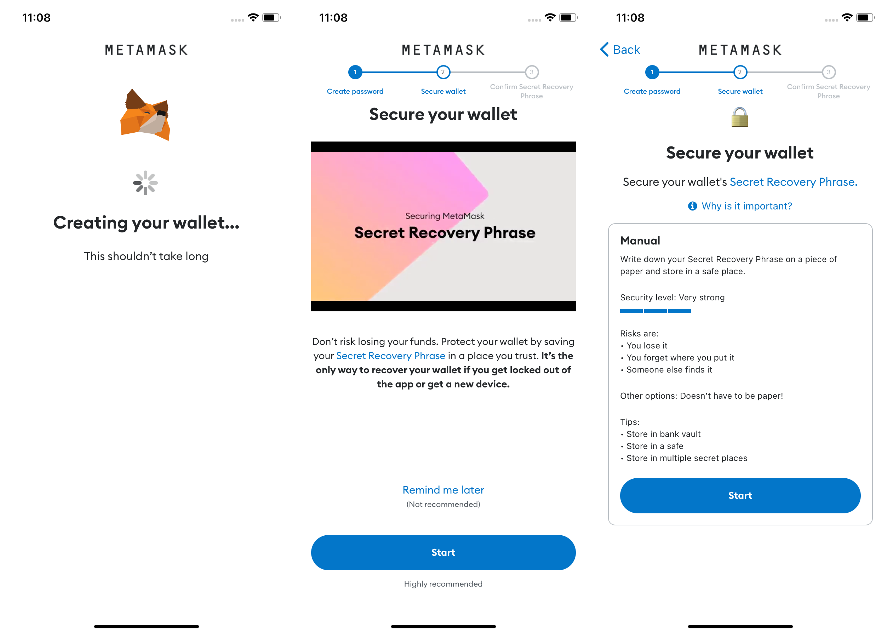
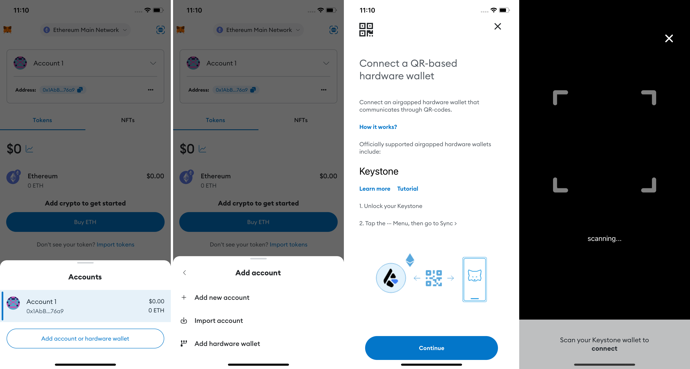
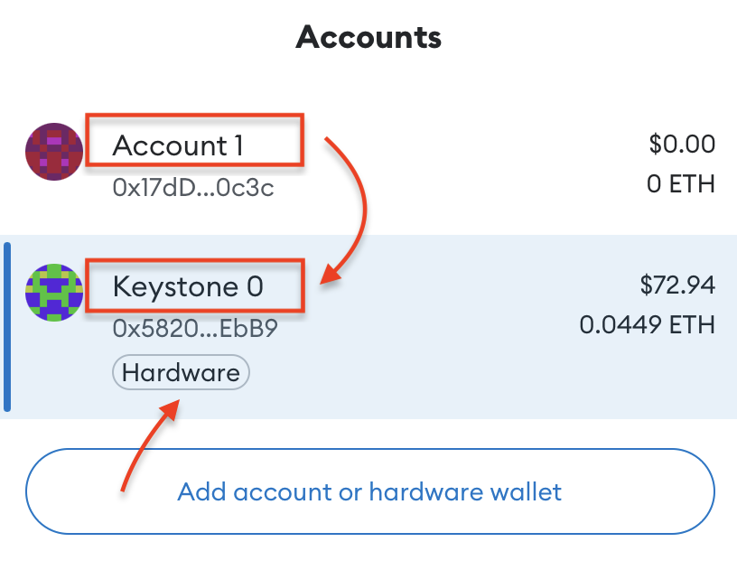
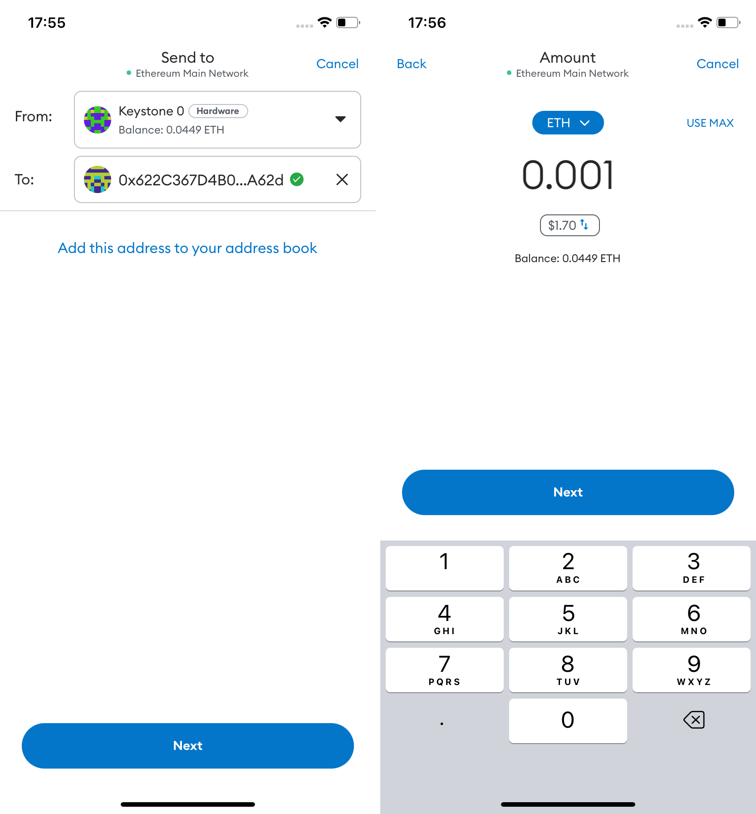
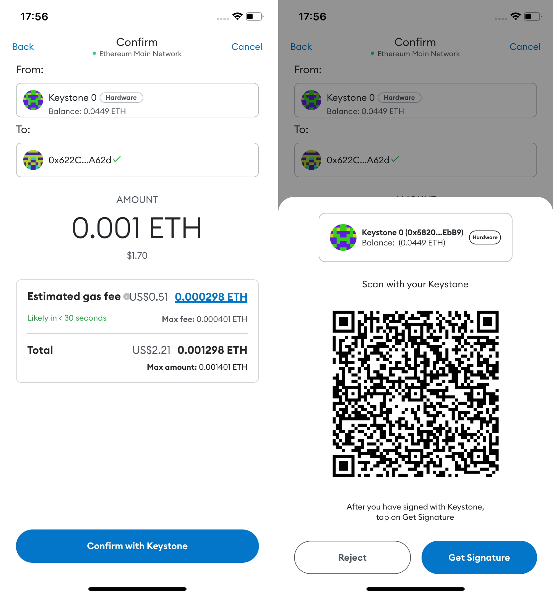

# How to connect with MetaMask Mobile? {#4588560a4fb14cba978769ede975ea77}

Keystone is the exclusive hardware wallet fully compatible with MetaMask Mobile, granting you access to all Ethereum Virtual Machine (EVM) chains, main cryptocurrencies, tokens, and decentralized applications on EVM chains.

## **Preparation** {#9034a4700c43413aa8a70f7b508e387b}

1. A Keystone 3 Pro
1. Download the latest version of **MetaMask Mobile** or newer from the Google Play Store or Apple App Store.

## **Step 1: Set Up a Dummy Wallet on MetaMask Mobile** {#ed0603bf6663400086bd416b01047794}

To access the [Connect Hardware Wallet] button in MetaMask, you need to create a dummy wallet. Follow these steps:

1. Run "MetaMask Mobile" and get started.

	

1. Tap [Create a new wallet] and follow the prompts to set a password.

	

1. Proceed with the "Secure your wallet" process and read the notes carefully.

	

1. Confirm your password and the Secret Recovery Phrase for your dummy wallet. Tap [Continue] to reconfirm the Secret Recovery Phrase, then tap [Complete backup] to finish the setup.

	

Congratulations! You have successfully set up MetaMask Mobile. Take some time to explore the various functions and features available.

## **Step 2: Connect Keystone Hardware Wallet to MetaMask Mobile** {#03bb6f2b2638464b90ac72a8319b0be5}

1. On your Keystone hardware wallet, select [MetaMask] in the menu to display a QR code.

	

1. On MetaMask Mobile, tap [Account 1], select [Connect Hardware Wallet], and scan the QR code on Keystone.

	

1. Choose your account and tap [Unlock] to complete the connection. You can unlock the 1st account if you are new here.

:::tip

**Tips for Differentiating Keystone and MetaMask Accounts:**
1. Check for distinct names.

1. Keystone accounts have a "Hardware" label below them.

:::

Congratulations! Your Keystone hardware wallet is now successfully connected to MetaMask Mobile. 

## **Sending ETH via MetaMask Connected to Keystone** {#5729d279a2004441ac42d8754f313fc8}

1. Find the "Send" button on MetaMask's home page.

	

1. Enter the amount of ETH and the recipient's address.

	

1. Review and confirm the transaction details.

	

1. MetaMask generates a QR code; scan it with your Keystone.

	

1. Verify and securely sign the transaction with your Keystone password.

	

1. Return to MetaMask, scan the QR code on your Keystone, and your transaction is pending confirmation on the Ethereum blockchain.

	

And there you have it! You've successfully sent your cryptocurrency to another address.

Once you've connected Keystone with MetaMask, you can do more than just send currency easily. **You can still access all of MetaMask's features.** 

Keystone, as a hardware wallet, secures your assets, and all transactions after binding require Keystone's signature. Plus, you can explore and use various online features in MetaMask to meet your basic needs.

## FAQ: {#a06085be9a714ef6b010db6f96cc16de}

  
Which Account to Connect When Binding Keystone with MetaMask?

If you're new, you can use the 1st account for unlocking. You can manage various addresses to suit different asset management needs and personal habits.

  

  
Why is Importing MetaMask Seed Phrase into Keystone Not Recommended?

Seed phrases generated online, like through MetaMask, can have higher hacking risks compared to ones generated entirely offline. **Even if you later import an online seed phrase, it will NOT provide secure protection since it could have already been exposed.** Remember, your seed phrase is the key to your funds.

  

  
How to Access Other EVM-Compatible Networks like Arbitrum or Polygon?

1. Bind Keystone with MetaMask.
2. Visit Chainlist and search for the desired network/chain to add to MetaMask.
3. Confirm the tokens you need to manage.

  

