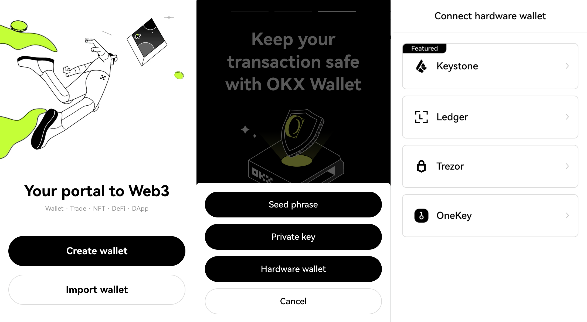

# How to connect with **OKX Wallet Extension** {#182e53897c484f6e874026fd01d7c7d3}

Welcome to the tutorial that will guide you through the process of connecting your Keystone hardware wallet with the OKX Extension. In this tutorial, you'll learn how to establish the connection and explore the fundamental features of OKX Wallet, including sending transactions and utilizing the decentralized exchange (DEX). Let's dive in!

**Supported Chains**: BTC and EVM Chains (Compatible with Keystone)

**Features**: Send, Receive, Swap, and so on.

## **Step 1: Preparing for Connection** {#244308f8c1654ee2b51b522954f2925c}

1. A Keystone 3 or Keystone 3 Pro hardware wallet.
1. Download the latest version of the [**OKX Wallet extension**](https://chrome.google.com/webstore/detail/okx-wallet/mcohilncbfahbmgdjkbpemcciiolgcge).

## **Step 2: Connecting Keystone with OKX Wallet** {#1a0f9a32179c4236a5dc152a362ecc1f}

**On Your Keystone Hardware Wallet:**

1. Tap the "..." icon and choose [OKX Wallet].
1. A QR code will appear, ready to be scanned with OKX Wallet.

	

**On OKX Wallet:**

1. Open the OKX Extension and select "I already have a wallet."
1. Opt for "Hardware Wallet" and then select "Keystone."

	

1. Allow OKX Wallet to access your device's camera. Scan the QR code displayed on your Keystone hardware wallet.
1. Choose the desired account and set a default wallet. Create a strong password to unlock your wallet.

	

1. If you prefer, you can skip this step by choosing "Maybe later." Once completed, you'll be successfully logged into OKX Wallet.

	

Congratulations! You've seamlessly connected your Keystone account on EVM chains with OKX Wallet. Now you're ready to explore its features securely.

