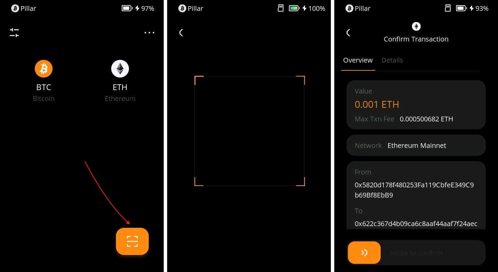

# **How to Connect Keystone with Rabby Wallet** {#9590e3cb9a884f90bb804f03318fc624}

Rabby Wallet is an EVM-compatible extension especially designed for Keystone Essential or Pro hardware wallets. With Rabby, you can securely manage your ETH, ERC-20, and other assets with ease and convenience.

Benefits of using Rabby with Keystone:

1. **Multiple Sets of Mnemonic Phrases:** Unlike some other wallets like MetaMask, Rabby can connect with multiple sets of seed phrases while still being connected with Keystone. This gives you more flexibility in managing different wallets and assets.
1. **Switch Between Supported Networks:** Rabby allows you to switch between different networks like Arbitrum and Polygon, providing you access to various EVM-compatible blockchain ecosystems.
1. **Connect with Other Software Wallets:** You can also connect Rabby with other software wallets, such as MetaMask, enabling a seamless and interconnected experience.

With Keystone connected, you can enjoy these features while having the peace of mind that your seed phrase and private keys remain securely stored in the hardware wallet's secure element, offering enhanced security.

## **Step 1: Preparation** {#fc9d0e6aee8d440fbd71962e321b56bd}

1. A Keystone 3 or Keystone 3 Pro
1. Download the latest Rabby browser extension from the [**official website**](https://rabby.io/) of Rabby Wallet.

	

## **Step 2: Connecting Keystone with Rabby Wallet** {#b39c8c07b05b4d928b4181ecfd40ca73}

**On your Keystone hardware wallet:**

1. Tap the "..." icon and select [Rabby]. A QR code will be displayed for you to scan with Rabby.

	

**On Rabby Wallet:**

1. Run the "Rabby Extension" in your browser. Read the information and click [Next], then click [Get Started].

	

1. Click [Connect Hardware Wallet] and select [Keystone]. Set a password to unlock your wallet on Rabby and use the camera to scan the QR code displayed on Keystone.

	

1. A batch of addresses will be shown. Toggle the address you need, and that's it! (If you are new here, you can use the 1st address to unlock it.)

You have successfully linked your Keystone account on EVM chains with Rabby. Now you can sign various activities supported by Rabby with ease, like sending ETH, swapping, browsing your NFT, etc. You can also switch it to different networks.

## **Sending ETH via Rabby Connected to Keystone** {#855c46e07688447ba3688e36badeac11}

1. Find the "Send" button on Rabby's home page. Enter the amount of ETH, and the recipient's address, and proceed to enter the password to confirm the transaction.

	

1. Review and confirm the transaction details.

	

1. Rabby generates a QR code; scan it with your Keystone.

	

1. Verify and securely sign the transaction with your Keystone password.

	

1. Return to Rabby, scan the QR code on your Keystone, and your transaction is pending confirmation on the Ethereum blockchain.

And there you have it! You've successfully sent your cryptocurrency to another address.

Once you've connected Keystone with Rabby, you can do more than just send currency easily. **You can still access all of Rabby's features.** 

Keystone, as a hardware wallet, secures your assets, and all transactions after binding require Keystone's signature. Plus, you can explore and use various online features in Rabby to meet your basic needs.

