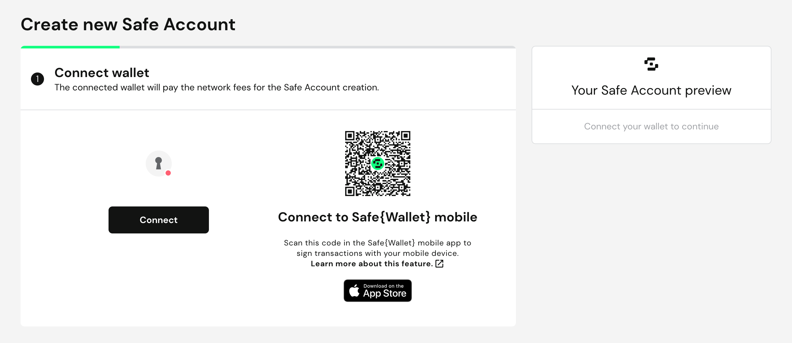
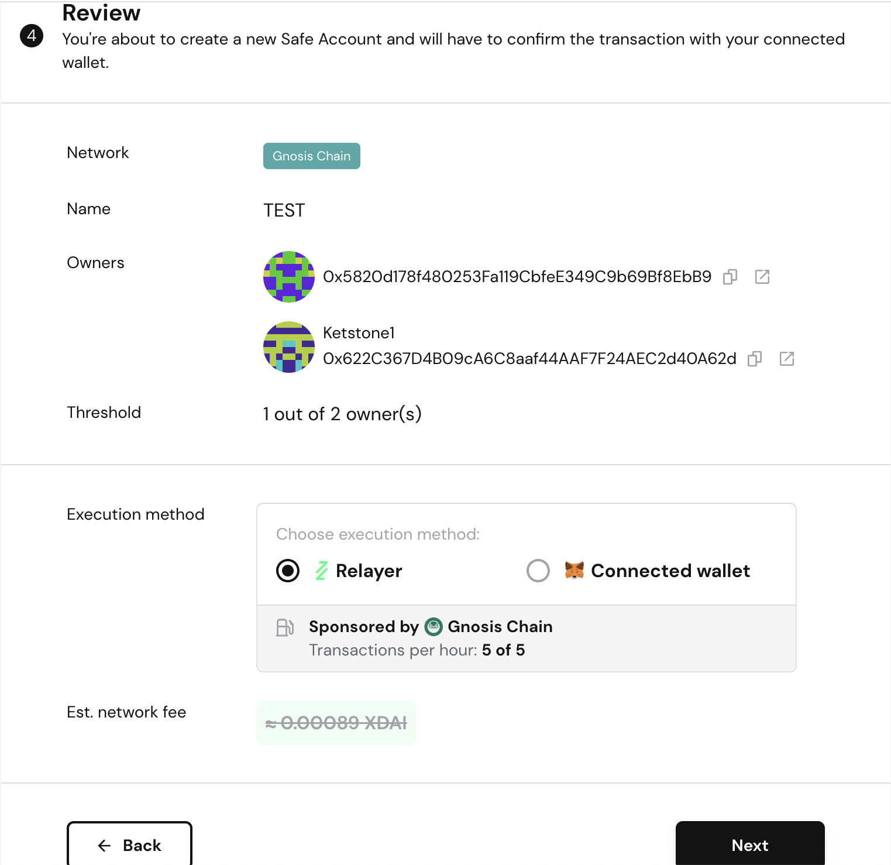
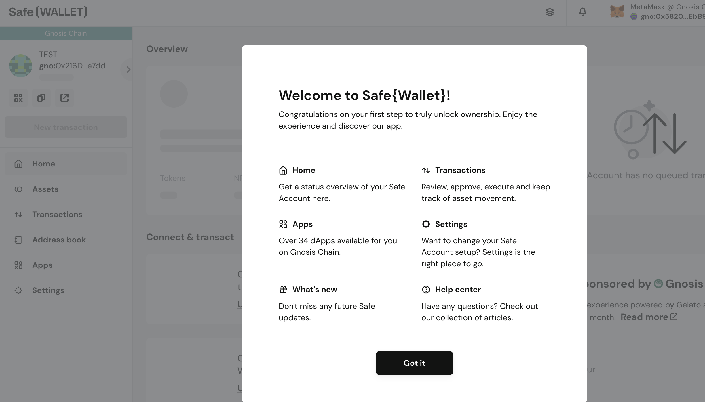

# **Safe{Wallet} (Web)** {#43493b0a9dc64128bcb7a6987d7057f0}

The Safe{Wallet} introduces a robust multi-signature wallet solution that extends support to EVM chains. Creating a multi-signature wallet within the Safe Wallet involves connecting a primary wallet, referred to as the "owner key." By selecting the appropriate network, additional addresses can be imported to establish supplementary "owner keys." This amalgamation culminates in the formation of a multi-signature wallet structure. Notably, any asset transfers to this wallet necessitate the endorsement of one or more owner keys to successfully execute transactions.

Employing a multi-signature wallet adds an extra layer of security to safeguard your assets.

This tutorial outlines the process of crafting a multi-signature wallet utilizing OKX Wallet and Keystone as owner keys.

## Step1: **Preparation** {#0f07b12b097f43f797a969aeaa4b59d3}

1. [Safe Wallet](https://app.safe.global/welcome) on the website
1. Keystone Gen3 Hardware Wallet
1. An existing registered OKX Wallet (extension version) (For the purposes of this tutorial, we assume you've established a connection between Keystone and OKX Wallet. Learn how to connect **here**.)

## **Step2: Create a multi-sig with Keystone** {#512cf7d4e34943ee90173bd3a15e7318}

### **Connecting with Safe** {#4221a4aa986d4780a9f142187cdc5f15}

1. Upon accessing the [Safe web wallet](https://app.safe.global/welcome), initiate the process by clicking [Create Safe Account].

	

1. Click the [Connect] option.

	

1. Opt for the [OKX] icon.

	

1. The OKX Wallet extension will display a [Connect Wallet] message. Proceed by clicking [Connect].

	

### **Assigning a Name to Your Safe Wallet** {#6d25c678dd8a42a5b52b0f9fc8652781}

1. Modify the wallet name within the designated field and advance by clicking [Next].

	

### **Incorporating a Second Owner Key** {#12634bb06cfa43098c3b690aad268929}

1. Click [Add new owner] and then access the QR code icon.

	

1. Launch your Keystone wallet, navigate to [ETH] on the home page, and opt for an address. 
To prevent duplication, I'll select an alternate account since I initially chose the first account when linking Keystone with OKX.

	

1. In the Safe web wallet, employ your computer's camera to scan the QR code of the selected address. This successfully adds the address.

	

1. Proceed by scrolling down and setting the number of your threshold and clicking [Next].
For example, if you have configured a 1-2 multi-signature wallet, similar to my configuration, initiating a transaction within this wallet would require only one owner's signature to successfully broadcast the transaction. On the other hand, if you have set it to 2-2, both owners' signatures will be required for a successful transaction broadcast.

	

### **Review and Confirmation** {#827c63e4e89f4baa9e0163a1f517db72}

1. Carefully review the particulars of your multi-signature wallet. Designate the preferred payment method for creating the wallet fee. Conclude this step by clicking [Next].

	

### **Wallet Creation Confirmation** {#453c5ae415304393906e5d3289c6c53b}

1. Allow Safe the necessary time to create the wallet. This phase may span a few minutes. Once clickable, select [Start using Safe].

	

1. Congratulations! Your wallet creation is triumphant. Explore the page of the freshly crafted multi-signature wallet at your leisure.

	

