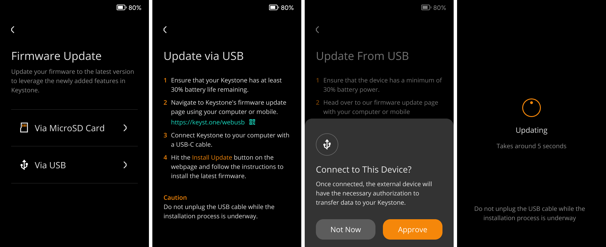

# **Firmware Upgrade via USB or SD Card** {#34838b70473b475e9311498d0d8f7fc3}

Firmware upgrades are important as they bring new features, bug fixes, and support for new blockchains. 

Upgrading your Keystone wallet is easy, and here is the way to upgrade via SD Card.

## Upgrade via SD card {#e611be8536e848e9b49a8a1b7cccb052}

### **What you'll need** {#42adf8e4ca264807b2c4a8ab0e9a4870}

1. Keystone 3 Pro
1. SD card and SD card reader
1. Computer

### **Steps** {#88c07774bc334e868c5733276f773708}

1. **Check Battery**: Make sure your Keystone wallet has at least 20% battery charge.
1. **Format SD Card**: Insert the SD card into your computer and format it as FAT32.
1. **Get Firmware**: Download the latest firmware version from the [**Keystone Firmware Upgrade**](https://keyst.one/firmware) and save the "keystone3.bin" file to the root of your MicroSD card.
1. **Insert SD Card**: Place the SD card with the firmware into your Keystone wallet.
1. **Start Upgrade**: Access the "Upgrade" option on your Keystone wallet, then follow the on-screen instructions to initiate the upgrade process.

That's it! Your Keystone wallet firmware will be upgraded.

## **Upgrade via USB Cable** {#f794865a31474dd9b57193349c6930f1}

### **What you'll need** {#233ec1d5e6594c339d625df948266fec}

1. Keystone 3 Pro
1. USB Cabel
1. Computer

### **Steps** {#bc14d1fbb9204dc5aeb07a57bfdcd586}

1. **Check Battery**: Ensure your Keystone wallet has at least 20% battery charge.
1. **Connect**: Tap on [via USB] and use the USB cable to connect your Keystone wallet to your computer. Tap [Approve] to grant your Keystone wallet USB access, as it might otherwise only allow charging.
1. **Upgrade**: Open your computer's web browser and go to the [**Firmware Upgrade**](https://keyst.one/firmware) page.
1. **Install**: On the upgrade page, click the "Install Upgrade" button and follow the provided instructions to install the latest firmware.

## FAQ {#1cbd53ed0dad4b97a357a51fc5aab3d4}

To ensure the security of your device during upgrades, follow these steps:

  
How to Protect Against Malicious Attacks During Upgrades

1. **Trust Official Sources:** Only download firmware updates from the [official Keystone website](https://keyst.one/) or [GitHub](https://github.com/KeystoneHQ). These updates are signed with our private keys, preventing any unauthorized or malicious firmware from being installed.
2. **Avoid Third-Party Sources:** Do not download firmware from unofficial sources or links provided by unknown parties.
3. **Verify Checksum:** Always compare the checksum provided on the firmware download page with the checksum on your device to ensure they match.

	By following these precautions, you can safeguard your device from potential malicious attacks during the upgrade process.

  

  
Is Firmware Upgrade Necessary?

Firmware upgrades typically introduce support for new blockchains, address bug fixes, and offer new features. If your current version already meets your requirements and you do not need the new functionalities or fixes, upgrading may not be necessary. However, staying up-to-date with the latest firmware ensures that your device remains secure and compatible with the evolving blockchain landscape.

  

