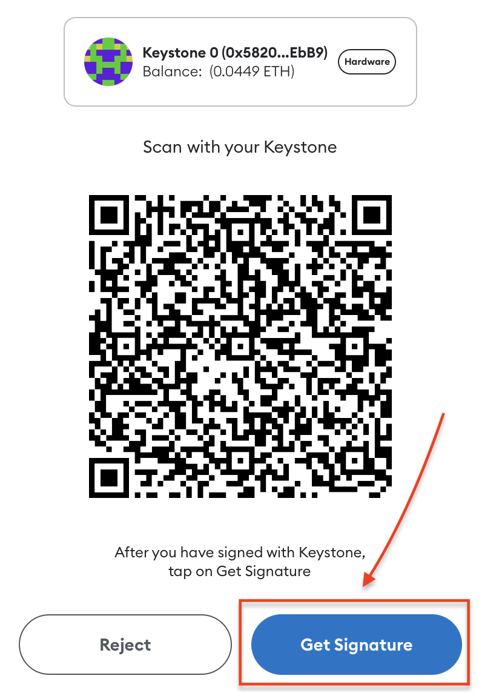

# **如何将Keystone与Rabby钱包连接** {#07ac0ba44a1f40dda229a2646d3ea5b6}

Rabby钱包是专为Keystone Essential或Pro硬件钱包设计的与EVM兼容的扩展程序。通过Rabby，您可以安全便捷地管理您的ETH、ERC-20和其他资产。

使用Rabby与Keystone的好处：

1. **多组助记词：** 与MetaMask等其他钱包不同，Rabby可以连接多组助记词，同时与Keystone连接。这使您在管理不同钱包和资产时更加灵活。
1. **切换支持的网络：** Rabby允许您在不同的网络之间切换，如Arbitrum和Polygon，让您访问各种EVM兼容的区块链生态系统。
1. **与其他软件钱包连接：** 您还可以将Rabby与其他软件钱包（如MetaMask）连接，实现无缝互联的体验。

通过连接Keystone，您可以在享受这些功能的同时，安心知道您的助记词和私钥仍安全存储在硬件钱包的安全元素中，提供增强的安全性。

## **步骤1：准备** {#d1463c7d78d54eae8b6d56982c58a73e}

1. Keystone Gen 3
1. 从[Rabby钱包的官网](https://rabby.io/)下载最新的Rabby浏览器扩展程序。

	

## **步骤2：连接Keystone与Rabby钱包** {#6ef77108fed44efb8226baa1753c30ac}

**在您的Keystone硬件钱包上：**

1. 点击“...”图标，选择[Rabby]。将显示一个二维码供您在Rabby钱包中扫描。

	

**在Rabby钱包上：**

1. 在浏览器中运行“Rabby扩展程序”。
1. 阅读信息，点击[下一步]，然后点击[开始]。

	

1. 点击[连接硬件钱包]，选择[Keystone]。
1. 设置一个密码，在Rabby上解锁您的钱包，并使用摄像头扫描Keystone上显示的QR码。

	

1. 一系列地址将显示出来。如果您是新用户，可以使用第一个地址进行解锁。您可以使用几个地址根据不同的需求和习惯管理您的资产。
1. 选中您需要的地址，完成连接。

	

您已成功将Keystone在EVM链上的帐户与Rabby钱包连接。现在您可以使用Rabby轻松签署各种支持的活动，例如发送ETH、兑换、浏览您的NFT等。您还可以切换到不同的网络。

## **发送ETH** {#b0e9663a7fc3496e9c80bc5936c5bac0}

1. 在 Rabby 主页上，查找“发送”按钮。输入您想发送的以太币（ETH）金额以及收款人地址**。**

	

1. 此时Rabby将显示交易信息，请确认交易信息是否正确。确认后，Rabby将生成一个代表交易的二维码。

	

1. 拿出Keystone 然后扫描Rabby上生成的 二维码。此时，Keystone会对二维码内容进行解析，展示真实的交易详情，请检查金额和收款人地址。

	

1. 输入 Keystone 的密码或者用指纹来签署交易后，将生成一个已授权交易的二维码。

	

1. 返回到 Rabby，点击“获取签名”后扫码Keystone上的二维码。此时，等待在以太坊区块链上广播和确认即可。

就是这样！您已成功将加密货币发送到另一个地址。

将Keystone与Rabby连接后，不仅可以发送货币，**还能使用Rabby的各种功能。**

Keystone会保护您的资产，绑定后的所有交易都需要Keystone的签名。此外，您还可以探索并使用Rabby中的各种在线功能，以满足您的基本需求。

